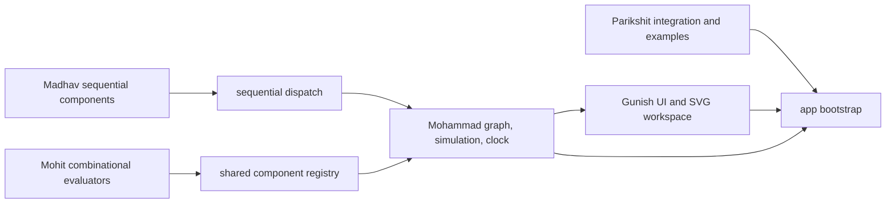

# Team Structure

The member folders define ownership boundaries for one integrated LogicFlow application. Shared infrastructure belongs in `shared/`; application startup and orchestration belong in `app/`. Members should primarily work in their assigned areas and coordinate cross-folder changes through interfaces and pull requests.

| Member | Enrollment | Role | Responsibility |
|--------|------------|------|----------------|
| Parikshit Singh | BCG26143 | Group Leader | Integration, examples, documentation |
| Gunish Singh | BCG26041 | Member | UI, workspace, styling |
| Mohammad Arsh | BCG26260 | Member | Circuit model, simulation, clock |
| Mohit Pangti | BCG26186 | Member | Gates and combinational circuits |
| Madhav Gupta | BCG26204 | Member | Sequential circuits and testing |

## Ownership Folders

- `team/Parikshit-Singh/`: `project-management/`, `integration/`, `examples/`, and `documentation/`. Owns coordination notes and the integrated editable AND example; does not duplicate component or engine implementations.
- `team/Gunish-Singh/`: `ui/`, `component-palette/`, `workspace/`, and `styling/`. Owns status feedback, searchable palette construction, SVG rendering, and application styling.
- `team/Mohammad-Arsh/`: `circuit-model/`, `simulation-engine/`, `sequential-logic/`, and `clock-system/`. Owns the graph, signal propagation, sequential dispatch boundary, and clock controller.
- `team/Mohit-Pangti/`: `logic-gates/`, `combinational/`, `adders-subtractors/`, `multiplexers/`, `decoders-encoders/`, and `parity/`. Owns the registered combinational evaluators.
- `team/Madhav-Gupta/`: `flip-flops/`, `registers/`, `counters/`, `truth-tables/`, and `testing/`. Owns state transitions, characteristic tables, and the browser-run validation suite.

## Integration Flow



The component registry defines pin metadata. The simulation engine dispatches combinational behavior to Mohit's modules and state transitions through Mohammad's interface to Madhav's modules. The renderer reads the circuit model; it does not own or calculate logic behavior.

## Branch Ownership

Suggested team branches:

- `feature/parikshit-integration`
- `feature/gunish-ui`
- `feature/mohammad-simulation`
- `feature/mohit-combinational`
- `feature/madhav-sequential`

General task branches such as `feature/gate-system`, `feature/circuit-canvas`, `feature/simulation-engine`, `feature/save-load`, `fix/wire-connection`, and `docs/readme` are also appropriate. A branch should primarily change the responsible member's folder, with shared/app changes limited to necessary integration work.

## Git Commands

Branches are feature-work lanes, not separate applications: each starts with the shared project baseline, then carries commits for its owner's code. Before using these commands, commit the integrated baseline to the base branch and make sure the working tree is clean. If your base branch is not named `main`, substitute its actual name. Run one block from the repository root before starting that member's changes; after the branch is created, make the changes, then run the remaining stage/commit/push commands.

```bash
git fetch origin
git switch main
git pull --ff-only
git switch -c feature/parikshit-integration
# Make Parikshit's integration/documentation changes, then stage them.
git add team/Parikshit-Singh/ docs/ README.md
git add -p app/app.js shared/
git commit -m "docs: integrate team project structure"
git push -u origin feature/parikshit-integration
```

For Gunish's UI and workspace work:

```bash
git fetch origin
git switch main
git pull --ff-only
git switch -c feature/gunish-ui
# Make Gunish's UI/workspace changes, then stage them.
git add team/Gunish-Singh/ index.html
git add -p app/app.js shared/
git commit -m "feat: improve simulator workspace"
git push -u origin feature/gunish-ui
```

For Mohammad's circuit model, simulation, and clock work:

```bash
git fetch origin
git switch main
git pull --ff-only
git switch -c feature/mohammad-simulation
# Make Mohammad's model/simulation/clock changes, then stage them.
git add team/Mohammad-Arsh/
git add -p shared/components/ app/app.js
git commit -m "feat: extend circuit simulation"
git push -u origin feature/mohammad-simulation
```

For Mohit's combinational component work:

```bash
git fetch origin
git switch main
git pull --ff-only
git switch -c feature/mohit-combinational
# Make Mohit's combinational component changes, then stage them.
git add team/Mohit-Pangti/
git add -p shared/components/ app/app.js
git commit -m "feat: add combinational components"
git push -u origin feature/mohit-combinational
```

For Madhav's sequential logic and testing work:

```bash
git fetch origin
git switch main
git pull --ff-only
git switch -c feature/madhav-sequential
# Make Madhav's sequential logic/test changes, then stage them.
git add team/Madhav-Gupta/
git add -p shared/components/ app/app.js
git commit -m "feat: extend sequential logic tests"
git push -u origin feature/madhav-sequential
```

Use one member block at a time. `git add -p` lets you stage only that member's required integration hunks from shared files. Then open a pull request into `main`. For an existing local branch, use `git switch <branch>` and `git push` instead of creating it again.